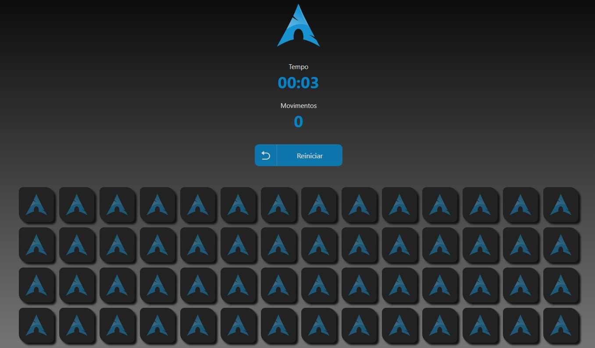

# Memory Game ! 🎮
 

## Vamos se divertir um pouquinho. 😃 

## Tecnologias que utilizei para o projeto ;  

 
    
    
    
    

 

##  As funcionalidades:
- Reiniciar ;
- Tempo ;
- Movimentos ;
## O código foi desenvolvido usando os conceitos ; 
- useState ;
- useEffect ;
- Resposivo
## A estilização ; 
- Styled Components; 
## 🎲 Rodando o Back End (servidor)
- npm install
- npm run dev

